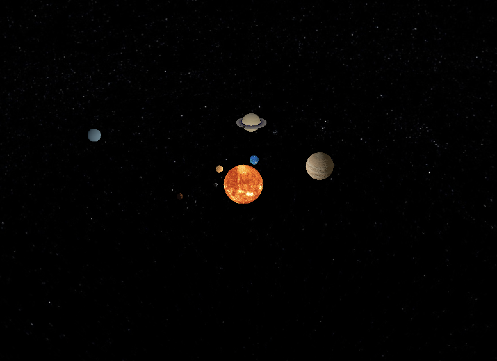

# Solar System Simulation 🌌

This project is a (un)realistic simulation of the solar system using Python and OpenGL. 🪐 It features accurate modeling of the planets, their textures, and their orbits around the sun. The simulation also includes advanced lighting techniques, such as the Phong Reflection Model and moving scene lights, to enhance the visual quality of the scene. ✨

## Features 🚀

- Camera that can orbit the solar system 🎥
- Accurate textures for each planet 🌍🌎🌏
- Phong Reflection Model for realistic lighting 💡
- Moving scene lights that correctly accumulate to light each object (Jupyter and Uranus emit light) 🔦
- Additional planets with their own scale and revolution speed 🌓
- Cloud texture for Earth that rotates faster than the planet itself ☁️
- Starry background for a more immersive experience 🌠
- Attenuation and gamma correction for realistic lighting 🌈

## Installation 💻

1. Clone the repository:

   ```bash
   git clone https://github.com/Anri-Lombard/Solar-System-Simulation.git
   ```

2. Navigate to the project directory:

   ```bash
   cd Solar-System-Simulation
   ```

3. Install the required dependencies using the provided Makefile:

   ```bash
   make install
   ```

## Usage 🚀

To run the solar system simulation, use the following command:

```bash
make run
```

## Controls 🕹️

- "W", "S", "A", "D": Orbit the camera around the solar system
- "Q", "E": Rotate the camera around its own axis
- "Space": Toggle the animation on/off

## Contributing 🤝

Contributions are welcome! If you find any issues or have suggestions for improvements, please open an issue or submit a pull request. 😊

## License 📜

This project is licensed under the [MIT License](LICENSE).

## Acknowledgements 🙏

- Planet textures and Starry background: [Solar System Scope](https://www.solarsystemscope.com/textures/)

## Screenshots 📸




Feel free to explore the universe with this solar system simulation! 🚀🌌
